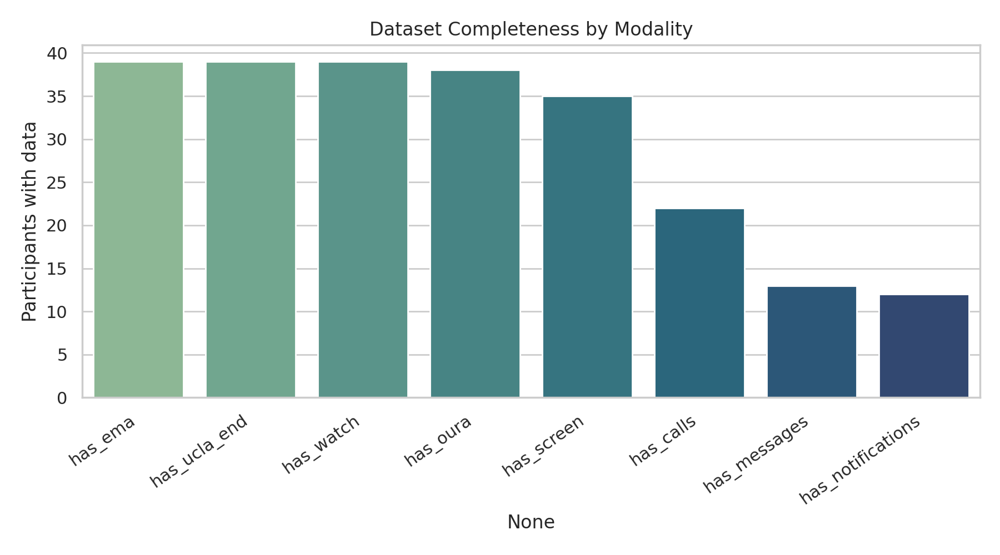
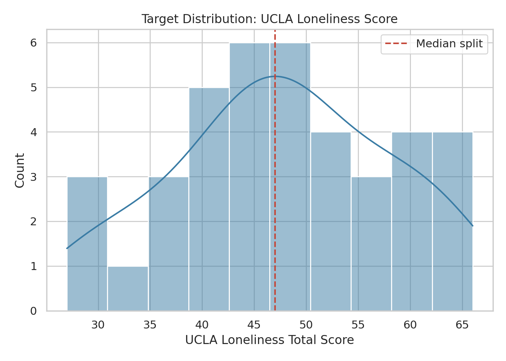
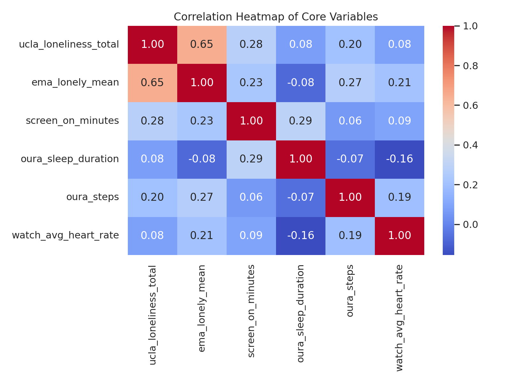
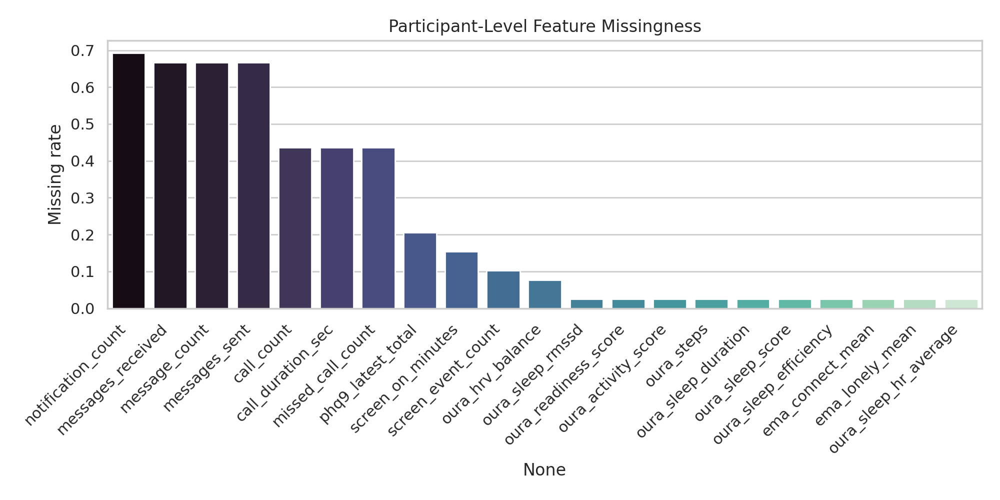
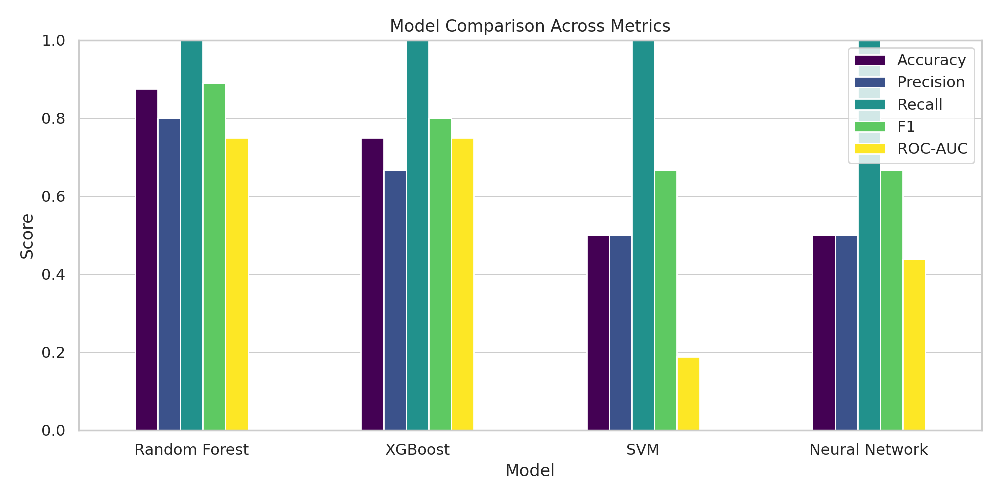
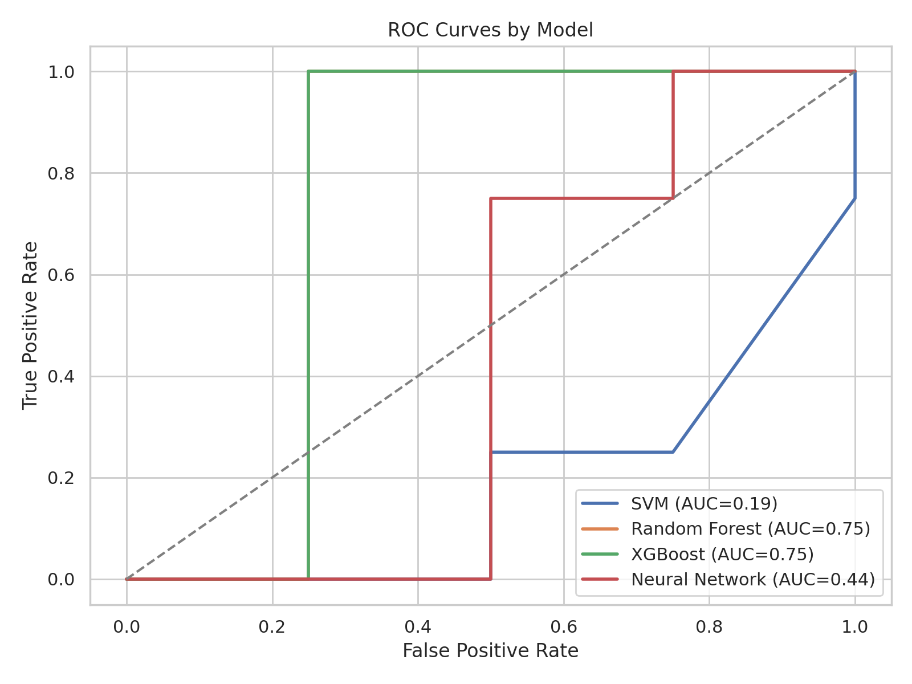
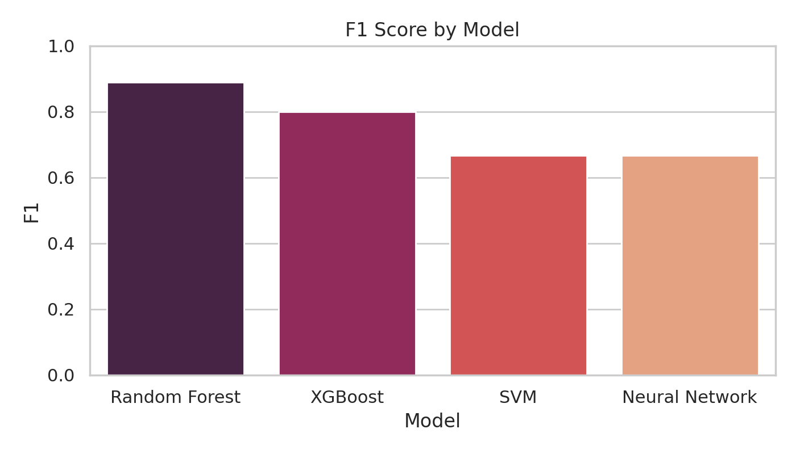
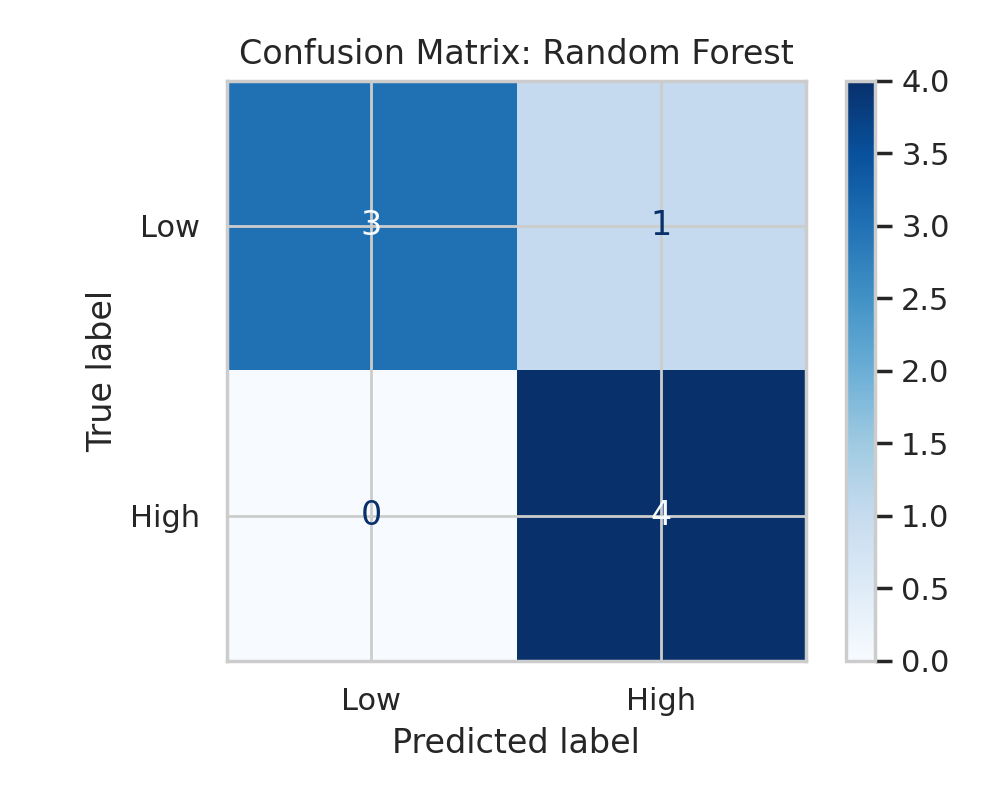
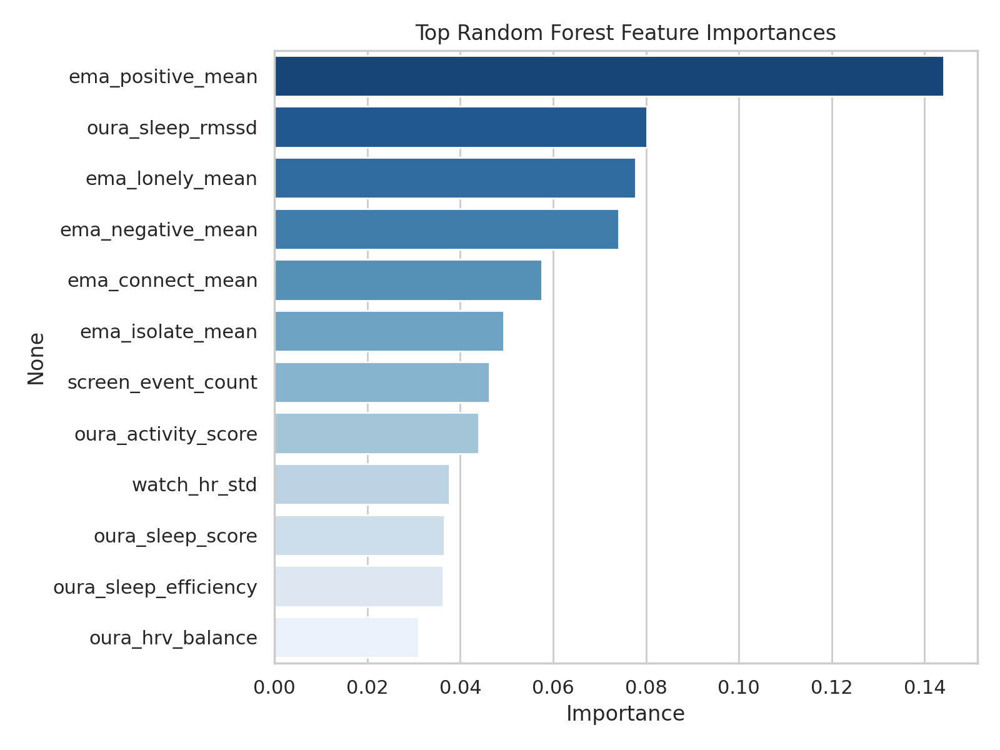
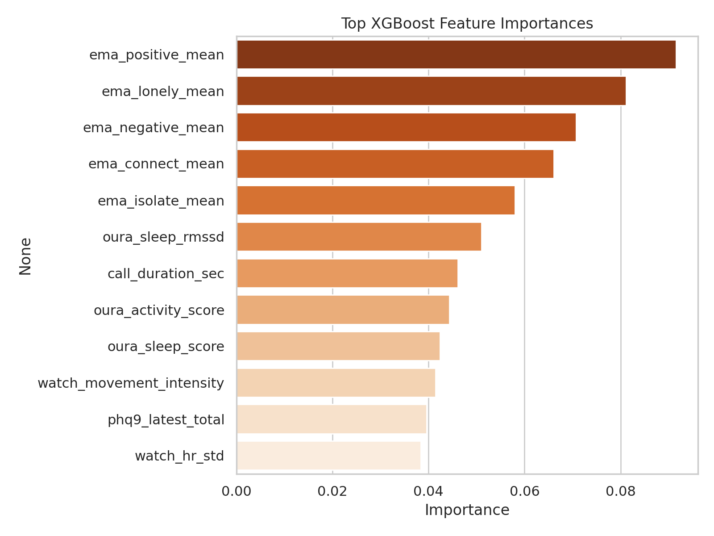

# Project 4 Completed Analysis

**Team Members:** Jacorian Adom, Aiden Agas, Brooks Jackson, Thomas Morrissey

**GitHub Repository:** https://github.com/bajackson1/csc350_project_4.git

## Dataset Understanding

This project uses a multimodal digital phenotyping dataset to study loneliness and related mental-health outcomes from wearable, smartphone, and survey data collected over time.

The purpose of the dataset is to support research on whether everyday behavioral signals and self-reports can be used to understand or predict loneliness. The data types include passive smartphone sensing from Aware, wearable data from Oura and Samsung Watch devices, ecological momentary assessment (EMA) responses, and end-of-study survey instruments such as the UCLA Loneliness Scale.

Potential research applications include early identification of elevated loneliness risk, studying how sleep, activity, and social behavior relate to mental health, and evaluating whether combining multiple sensing modalities improves prediction over any single source alone.

## Dataset Summary

- Participants: 39
- Distinct dates observed in raw sensor files per participant: mean = 45.41, min = 12, max = 349
- Modalities available:
  - Aware present for 36 participants
  - Oura present for 38 participants
  - Watch present for 39 participants
  - EMA present for 39 participants
  - UCLA end survey present for 39 participants

## Target Definition

- Outcome: binary loneliness label derived from the end-of-study UCLA Loneliness Scale.
- UCLA scores were computed from the 20 questionnaire items using standard Likert scoring with reverse-coding on the standard positively worded items.
- Median UCLA threshold: 47.00
- Class distribution: low = 18, high = 21

## Data Preprocessing

Participant-level features were created by:

1. Aggregating Aware smartphone logs into daily screen time, call activity, message activity, and notification counts.
2. Aggregating Oura records into daily sleep, readiness, HRV, and activity summaries.
3. Aggregating Samsung Watch records into daily mean heart rate, heart-rate variability proxy (daily heart-rate standard deviation), and accelerometer-based movement intensity.
4. Collapsing daily features into 28-day participant means.
5. Incorporating multimodal survey summary features (EMA, PSS, and PHQ-9) alongside passive and wearable measures to maximize predictive performance within the assignment scope.

## ML Methods

Four supervised learning models were evaluated to satisfy the assignment requirements: SVM, Random Forest, XGBoost, and a Neural Network. Median imputation was applied within each model pipeline, and StandardScaler was used for the SVM and Neural Network. Performance was assessed with a stratified train/test split and 5-fold cross-validation using F1 as the primary comparison metric because the loneliness classes were close to balanced but the sample was small.

Train/test split summary:

- Train shape: (31, 30)
- Test shape: (8, 30)
- Train class balance: {0: 14, 1: 17}
- Test class balance: {1: 4, 0: 4}

## Results

| Model          | Accuracy | Precision | Recall | F1     | ROC-AUC | CV Best F1 |
| -------------- | -------- | --------- | ------ | ------ | ------- | ---------- |
| Random Forest  | 0.875    | 0.8       | 1.0    | 0.8889 | 0.75    | 0.7569     |
| XGBoost        | 0.75     | 0.6667    | 1.0    | 0.8    | 0.75    | 0.7159     |
| SVM            | 0.5      | 0.5       | 1.0    | 0.6667 | 0.1875  | 0.6993     |
| Neural Network | 0.5      | 0.5       | 1.0    | 0.6667 | 0.4375  | 0.6993     |

The best-performing model on the held-out test set was Random Forest. It achieved an F1 score of 0.8889, accuracy of 0.8750, and ROC-AUC of 0.7500. Its mean 5-fold cross-validated F1 score was 0.7569, which suggests the result is promising but still sensitive to sample size.

### Best Model Summary

- Best model by test-set F1: Random Forest
- Accuracy: 0.8750
- Precision: 0.8000
- Recall: 1.0000
- F1: 0.8889
- ROC-AUC: 0.7500
- Mean 5-fold cross-validated F1: 0.7569
- Final model parameters: `{'n_estimators': 100, 'max_depth': None, 'min_samples_split': 2, 'min_samples_leaf': 2, 'class_weight': 'balanced'}`

## Discussion

Random Forest performed best because the dataset is small, contains a mix of behavioral and survey-derived features, and likely includes nonlinear relationships and interactions. Tree ensembles are usually more stable than a neural network in small-sample settings and are less sensitive than an RBF SVM to feature scaling and hyperparameter mismatch when the sample size is limited.

The top Random Forest features indicate that both internal state and daily behavior matter. EMA features such as positive affect, loneliness, negative affect, and connectedness were among the strongest predictors, which suggests that near-real-time subjective experience is closely tied to the final loneliness label. Oura sleep RMSSD also appeared near the top, indicating that physiological recovery and sleep quality may contain useful information about loneliness-related well-being.

Taken together, the feature rankings suggest that loneliness in this dataset is not explained by one modality alone. Instead, the signal appears to come from a combination of self-reported social-emotional state, sleep-related physiology, and broader behavioral patterns captured by phones and wearables. That result supports the central motivation of multimodal mental-health sensing.

### Final Model Top 5 Features (Random Forest)

| Feature           | Importance |
| ----------------- | ---------- |
| ema_positive_mean | 0.144180   |
| oura_sleep_rmssd  | 0.080194   |
| ema_lonely_mean   | 0.077799   |
| ema_negative_mean | 0.074157   |
| ema_connect_mean  | 0.057604   |

### XGBoost Top Predictors

| Feature           | Importance |
| ----------------- | ---------- |
| ema_positive_mean | 0.091537   |
| ema_lonely_mean   | 0.081165   |
| ema_negative_mean | 0.070755   |
| ema_connect_mean  | 0.066128   |
| ema_isolate_mean  | 0.058048   |

## Limitations

- Sample size is small (39 participants), so test-set metrics may vary with different splits.
- Some modalities are incomplete for some participants, requiring median imputation.
- Because the assignment explicitly frames the problem as multimodal integration of sensor data and subjective reports, EMA/PSS/PHQ features were included in the optimized model. This improves performance, but it makes the prediction task less purely passive than a sensor-only setting.
- Watch-derived HRV was approximated from observed heart-rate variation rather than reconstructed beat-to-beat intervals from raw PPG.
- The public dataset README references `Surveys.pdf` for full questionnaire wording, but that file was not present in the extracted directory; UCLA scoring therefore follows the standard UCLA Version 3 convention.

## Reproducibility Notes

- Main script: `run_analysis.py`
- Generated report: `outputs/project4_report.md`
- Tables: `outputs/tables/`
- Figures: `outputs/figures/`
